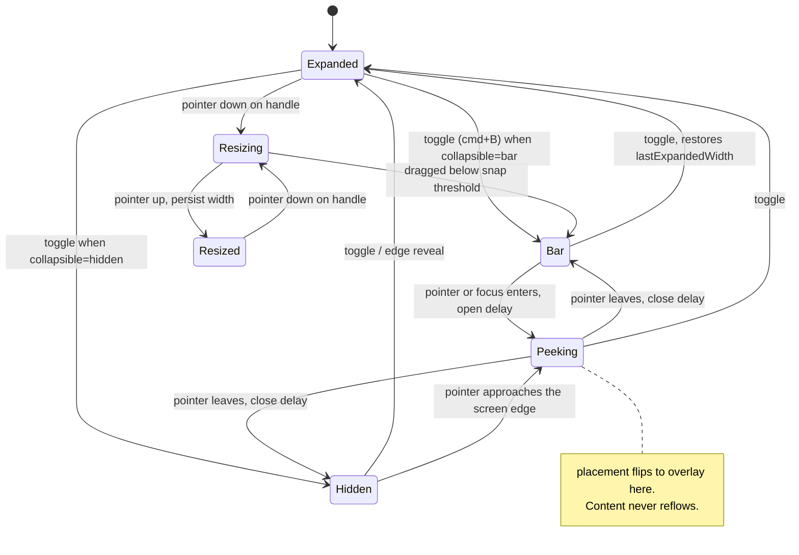

# Sidebar — design-first spec

Status: design only, no code. Scope: the React/shadcn showcase in this repo.

Review 2026-09-07: retained as historical architecture rationale, not a current API specification. A sidebar implementation now exists; the research snapshots, proposed parts, and build order below mix implemented and unimplemented ideas. The five-state model supersedes the later stale "six collapse states" wording, and peek pinning is not an approved requirement. See the [current review](README.md).

---

## 1. What a sidebar actually is

Every sidebar in every app is doing one to three jobs at once. Naming them is
the whole design, because each job has a different content model, a different
overflow behaviour, and a different set of states.

| Job | Content model | Bounded? | Ordering | Overflow strategy |
| --- | --- | --- | --- | --- |
| **Navigate** — destinations | Fixed information architecture, authored by the app | Yes, ~5–15 rows | Authored | None needed |
| **Collect** — the user's stuff | Chats, pages, tabs, files, threads. User-generated | No. Assume 10,000 | Recency, hierarchy, or manual | Buckets + virtualize + search + "show more" |
| **Situate** — who and where | Workspace, account, plan, status, primary action | Yes, 1–3 rows | Pinned | None. Pinned to header/footer |

Almost every sidebar failure is a category error: treating an unbounded
collection like a bounded nav (no search, no virtualization, no buckets), or
treating the identity block like a list row (it scrolls away).

**The rule that follows:** a sidebar is composed of *regions*, and each region
declares which job it is doing. The region — not the sidebar — owns its
overflow, its sort, its empty state, and its loading state.

---

## 2. Research — what the good ones actually do

### shadcn (our current base)

Parts we already have: `SidebarProvider`, `Sidebar`, `Header`, `Content`,
`Footer`, `Group`, `GroupLabel`, `GroupAction`, `GroupContent`, `Menu`,
`MenuItem`, `MenuButton`, `MenuAction`, `MenuBadge`, `MenuSkeleton`,
`MenuSub` + `SubItem` + `SubButton`, `Separator`, `Input`, `Rail`, `Inset`,
`Trigger`, `useSidebar`.

Props: `side` left/right, `variant` sidebar/floating/inset, `collapsible`
offcanvas/icon/none. State: `open`, `openMobile`, `isMobile`, cookie
persistence, `cmd/ctrl+B`.

What it is: an excellent *shell and row primitive*. What it is not: it has no
answer for unbounded collections, resizing, hover-peek, drag, rename, search,
time buckets, or a rail that is a mode switcher rather than a collapsed state.

### ChatGPT

- Pinned action stack at the very top (new chat, search chats, library, GPTs) —
  these never scroll away and are visually separated from the collection.
- Projects as a container that chats can be dragged into.
- Chat list grouped by **time buckets** (Today / Yesterday / Previous 7 days /
  Previous 30 days / by month). Buckets are *derived*, not a user sort.
- Row overflow menu appears on hover and on focus: rename, share, archive, delete.
- Infinite scroll with lazy pagination; the list is never fully loaded.
- Collapse to a narrow icon rail; footer holds account + plan.

### Claude

- Same shape, plus **hover-peek**: when collapsed, hovering the rail expands the
  sidebar as a floating overlay *without* reflowing the page. Moving away
  re-collapses. This is a distinct state, not "open".
- Starred section above Recents; "see all" as a route, not infinite scroll.
- Projects with their own nested content.

### Notion (the most feature-complete sidebar shipping today)

- Workspace switcher in the header.
- **Top-level tabs** inside the sidebar (Home / Chats / Meetings / Inbox /
  Search) — the sidebar has *modes*, and each mode has its own content.
- Sections: Favorites, Teamspaces, Shared, Private, plus always-pinned bottom
  items (Templates, Trash, Settings).
- **Per-section `•••` menu**: sort (manual vs last edited), *show N items*
  (5…all), move section up/down, hide section. The user configures the sidebar
  itself.
- **"More" → secondary pane**: when a section is capped, "More" opens a
  *separate overlay panel* with its own search and sort, and that pane can be
  pinned open. This is the honest answer to "the list is too long".
- Infinite nesting via disclosure toggles; drag to reorder *and* to reparent,
  with a highlight showing the drop target; dragging into Trash deletes.
- Per-row `+` (create child) and `•••` (row menu) on hover.
- Unread indicated with a red badge on Inbox; a blue dot on individual AI chats.
- Resize by dragging the right edge. `cmd/ctrl + \` to collapse.
- Quick-entry buttons pinned at the bottom of each tab.

### Arc / Dia (browser sidebars)

- **Spaces**: several complete sidebars side by side, swipeable, each with its
  own accent colour/gradient theme. A space switcher rail sits at the bottom.
- A row of favicon-only tiles pinned at the top (favorites) — a grid inside a
  list.
- Pinned tabs above a divider, ephemeral "today" tabs below it, auto-archived
  after N hours. The divider is itself a drop target and a semantic boundary.
- Folders and split view; drag to reorder anything.
- The sidebar can be fully hidden and revealed as an overlay by pushing the
  pointer to the screen edge.
- Dia adds a **right-hand panel** for chat, so two sidebars coexist and each
  needs its own state.

### VS Code / Slack / Linear / Figma

- **Activity bar** (VS Code) and workspace rail (Slack) prove the key point:
  a narrow icon rail is often a *mode switcher*, not a collapsed sidebar. Both
  can exist at once — rail + panel.
- Linear: keyboard-first, section counts, everything reachable without hover.
- Slack: unread = bold label + count pill; muted = dimmed; presence dot on rows.
- Figma/Mail: three-pane — rail, list, content — where the middle pane is a
  *sidebar of records* with its own header, filter and sort.

### The distilled patterns worth stealing

1. Rail ≠ collapsed. Two separate concepts.
2. Hover-peek is a third shell state between open and closed.
3. Resizable width, persisted, with min/max and snap points.
4. Section-level configuration: sort, cap, order, visibility.
5. "Show more" that escalates to a secondary pane, not infinite growth.
6. Derived time buckets with sticky headers.
7. Row trailing cluster: badge + action + disclosure, revealed on hover *and* focus.
8. Inline rename, drag reorder, drag reparent, drop-to-delete.
9. Pinned regions that never scroll: primary action at top, identity at bottom.
10. Every collection has empty, loading, loading-more, error, and no-results states.

---

## 3. Three orthogonal axes: form, placement, collapse

The single biggest modelling mistake is treating these as one enum. shadcn's
`variant` and `collapsible` props already blur two of them, which is why an icon
rail and a collapsed sidebar are the same thing there and shouldn't be. Model
them as three independent axes that compose.

### Axis 1 — form: what shape is this thing?

| Form | Width | Holds | Part |
| --- | --- | --- | --- |
| **Panel** | resizable, `--sidebar-width-min…max` | Labelled rows, sections, collections | `Sidebar` |
| **Bar** | fixed, `--sidebar-dock-width` | Icon-only targets, no labels, tooltips required | `SidebarDock` |
| **Pane** | fixed, wider than the panel | A secondary overlay list with its own search and sort | `SidebarPane` |

A panel and a bar can coexist — `SidebarDock` + `Sidebar` side by side is the
VS Code / Slack / Mail shape, and the bar switches which content the panel
shows. That is a *layout*, not a collapse state, and it must survive the panel
being collapsed or hidden entirely.

### Axis 2 — placement: how does it relate to the content?

| Placement | Content reflows? | Dismiss | Typical trigger |
| --- | --- | --- | --- |
| `docked` | yes — takes layout space | n/a | desktop default |
| `floating` | yes, but inset with a radius and shadow | n/a | authored variant |
| `inset` | yes, content itself becomes a rounded card | n/a | authored variant |
| `overlay` | no — floats above content with no scrim | pointer leave, Escape | peek, tablet |
| `drawer` | no — floats above with a scrim | scrim, Escape, swipe, route change | mobile |

Placement is partly authored (`floating` vs `inset`) and partly derived from
viewport — `docked` above the desktop breakpoint, `drawer` below it. Derived and
authored placement need to be separate fields so a resize doesn't clobber the
author's choice.

### Axis 3 — collapse: how much of it is showing?

Five states, not three. This is the enumeration to build against:

| State | Panel width | Labels | Content reflows | Notes |
| --- | --- | --- | --- | --- |
| `expanded` | `--sidebar-width` (or persisted) | shown | yes | the resting state |
| `resized` | user's width, clamped to min/max | shown | yes | same as expanded, different width |
| `bar` | `--sidebar-width-icon` | hidden, tooltip required | yes | shadcn's `collapsible="icon"` |
| `hidden` | 0 | — | yes, content takes full width | shadcn's `collapsible="offcanvas"` |
| `peeking` | `--sidebar-width` | shown | **no** — overlays | transient, from `bar` or `hidden` |

The rules that fall out of the table:

- `peeking` is the only collapse state where placement flips to `overlay`. That
  coupling is the whole trick — the sidebar looks expanded but the page behind
  it never reflows, so there is no layout thrash on every hover.
- `bar` is a *collapse* state that happens to look like the `Bar` form. They are
  still different: a collapsed panel is one panel's rows shrunk to icons; a dock
  bar is a separate navigation surface. An app can show both at once.
- `hidden` needs an edge-reveal affordance or the sidebar is unrecoverable
  without a keyboard shortcut. Make that target generous — a hairline strip is
  something the user has to hunt for.
- `resized` below the snap threshold transitions to `bar`, not to a squashed
  panel. Dragging back out restores the last good width, not the default.
- Which collapse states are *reachable* is authored per sidebar:
  `collapse="none"` allows only expanded/resized; `"bar"` allows
  expanded/resized/bar/peeking; `"hidden"` allows all five.
- Peek is opt-in, because hover-peek and a hover-revealed toggle in the bar are
  mutually exclusive affordances. With peek off the toggle parks over the brand
  mark and returns on hover; with peek on the toggle simply fades out, since the
  peek itself is the way back.

### How the axes compose

```
form      panel │ bar │ pane
placement docked │ floating │ inset │ overlay │ drawer
collapse  expanded │ resized │ bar │ hidden │ peeking
```

Expressed as data attributes on the root so every child can style off them
without prop drilling: `data-form`, `data-placement`, `data-collapse`,
`data-side`, `data-resizing`. Only `collapse` and `placement` change at runtime.

---

## 4. The state model

This is the part to get right before writing a line of code. Five layers, with
different owners and lifetimes.

### Layer A — shell state (owned by the provider, one per sidebar instance)

| State | Values | Persist? |
| --- | --- | --- |
| `form` | `panel` / `bar` / `pane` | authored |
| `placement` | `docked` / `floating` / `inset` / `overlay` / `drawer` | authored + viewport-derived |
| `collapse` | `expanded` / `resized` / `bar` / `hidden` / `peeking` | yes, except `peeking` |
| `collapsible` | `none` / `bar` / `hidden` — which states are reachable | authored |
| `open` | boolean, derived: `collapse` is not `hidden` | via `collapse` |
| `width` | length within min/max | yes |
| `lastExpandedWidth` | restores after a snap-to-bar | yes |
| `isResizing` | boolean | no |
| `side` | `start` / `end` | authored |
| `mode` | active top-level tab, when the sidebar has modes | yes |

Shell state chart:



Mobile runs a parallel machine: `closed ⇄ drawer-open`, dismissed by scrim,
Escape, swipe, or route change. Route change closing the mobile drawer but *not*
the desktop sidebar is a real rule, not an accident.

### Layer B — region/section state

`expanded`, `sort` (manual / recent / alphabetical), `cap` (show N), `hidden`,
`order`, `count`, `status` (idle / loading / error). All persisted per user.

### Layer C — row state

The row is where most of the visual design lives. Model these as data
attributes, not classes:

`active` (this is the current destination) · `selected` (multi-select) ·
`focused` (roving tabindex) · `expanded` (has children, open) · `unread` ·
`badge`/`count` · `busy` (streaming/syncing) · `disabled` · `dragging` ·
`drop-target` (into / above / below) · `editing` (inline rename) ·
`pending` (optimistic, not yet saved) · `error` · `muted`.

Critical distinction most systems miss: **active** (route matches),
**selected** (checked in a multi-select), and **focused** (keyboard cursor) are
three different things that can all be true at once and must be visually
distinguishable.

### Layer D — collection state

`idle` · `loading` (skeleton rows) · `loading-more` (sentinel at the bottom) ·
`empty` (never had items — needs a call to action) · `no-results` (filter
matched nothing — needs a clear-filter action) · `error` (needs retry) ·
`stale/offline`. Empty and no-results are not the same screen.

### Layer E — session/interaction state

Drag session, context menu open, search query, keyboard navigation cursor,
scroll position restoration.

### Persistence contract

- **Persist**: `collapse` (collapsing `peeking` to its origin state), `width`,
  `lastExpandedWidth`, `mode`, and every per-section expanded/sort/cap/hidden value.
- **Restore on mount without flash**: read before first paint, or render with
  the persisted value inlined. A sidebar that visibly snaps from 16rem to 20rem
  on load is the single most noticeable bug in this component.
- **Never persist**: `peeking`, `isResizing`, drag session, search query, focus.
- **Derive, never store**: `open` (from `collapse`), the viewport half of
  `placement`, active row (from the route), time buckets (from timestamps),
  counts (from data).

---

## 5. What to build — the inventory

### Tier 0 — already shipped, keep

Provider, Sidebar, Header, Content, Footer, Group, GroupLabel, GroupAction,
GroupContent, Menu, MenuItem, MenuButton, MenuAction, MenuBadge, MenuSkeleton,
MenuSub/SubItem/SubButton, Separator, Input, Rail, Inset, Trigger, `useSidebar`.

### Tier 1 — the missing structure

| Part | Why | Reference |
| --- | --- | --- |
| `SidebarResizeHandle` | Real drag-resize with min/max, snap-to-collapse, double-click reset, keyboard arrows. Today `SidebarRail` only toggles. | Notion, VS Code |
| `SidebarPeek` | Collapsed rail expands as an overlay on hover/focus with an open and close delay; pin to keep. | Claude, Arc |
| `SidebarDock` | Narrow icon rail as a **mode switcher** that coexists with the panel. Not the same as `collapsible="icon"`. | VS Code, Slack, Arc spaces |
| `SidebarTabs` | Top-level modes inside one sidebar; each mode has its own content and its own scroll position. | Notion |
| `SidebarSearch` | Filter mode over the collection: query, clear, result count, no-results state, match highlighting, Escape to exit. Distinct from the global command palette. | All of them |
| `SidebarSection` | Group + disclosure + count + a `•••` settings menu (sort, cap, move, hide) in one part, so every section is configurable by default. | Notion |
| `SidebarBucketLabel` | Sticky, derived time-bucket header (Today / Yesterday / Previous 30 days). | ChatGPT, Claude |
| `SidebarShowMore` | Cap-aware expander: "Show more (24)" that either expands in place or opens `SidebarPane`. | Notion |
| `SidebarPane` | Secondary overlay panel with its own search/sort, pinnable — the honest answer to a 5,000-item section. | Notion |
| `SidebarTree` | Arbitrary-depth nesting with indent guides, one indent token per level, disclosure at every level. Today `MenuSub` is one level deep. | Notion, file explorers |
| `SidebarMenuMeta` | Optional second line (timestamp, snippet, path) → a two-line row variant with independent truncation. | Mail, Linear |
| `SidebarMenuRename` | Inline editable label: Enter commits, Escape reverts, blur commits, optimistic + error rollback. | ChatGPT, Notion |
| `SidebarMenuDot` | Unread dot vs count pill vs status dot — three different marks, one part, explicit semantics. | Slack, Notion |
| `SidebarDropIndicator` + `SidebarSortable` | Reorder, reparent, and drop-into-container, with above/below/into affordances and a keyboard-accessible move mode. | Notion, Arc |
| `SidebarLoadMore` | Intersection sentinel + explicit fallback button; never rely on scroll alone. | ChatGPT |
| `SidebarEmpty` / `SidebarError` | Per-section, not per-sidebar. With a call to action / retry. | — |
| `SidebarNewAction` | The one primary action pinned above the collection ("New chat"). Visually distinct from nav rows. | ChatGPT, Claude |
| `SidebarWorkspaceSwitcher` | Header row that opens a menu; avatar/logo + name + secondary line + chevron; collapses to the logo. | Notion, shadcn block |
| `SidebarAccount` | Footer identity row + menu; collapses to the avatar. | Everyone |
| `SidebarBanner` | Upgrade / trial / offline / incident notice above the footer, dismissible. | ChatGPT, Notion |
| `SidebarMeter` | Usage/quota progress with label and value. | Notion, Vercel |
| `SidebarTooltipLabel` | **Automatic** tooltip of the row label when collapsed to the rail. Must be built into the row, never hand-wired per call site. | VS Code |

### Tier 2 — behaviours (hooks, not markup)

- `useSidebarPersistence` — one storage adapter (cookie for SSR, localStorage
  otherwise), namespaced by sidebar id, no-flash restore.
- `useSidebarResize` — pointer + keyboard, min/max/snap, `isResizing` flag that
  disables transitions during drag.
- `useSidebarPeek` — open delay, close delay, focus-within, pointer-leave safety.
- `useSidebarNavigation` — roving tabindex, Up/Down, Left/Right to
  collapse/expand a tree node, Home/End, type-ahead.
- `useSidebarSearch` — debounce, match, highlight, and auto-expand ancestors of
  matches.
- `useSidebarDnD` — reorder/reparent with a keyboard move mode.
- Virtualization guidance: which parts are safe to virtualize (flat collection
  lists) and which are not (nested trees with variable-height rows).

### Tier 3 — blocks, so nobody composes these from scratch again

1. **App nav** — docs/dashboard: brand, nav groups, collapsible sections, footer account.
2. **Chat history** — new chat, search, projects, time-bucketed recents, row menu, infinite load.
3. **Workspace tree** — favorites, teamspaces, shared, private, drag/drop, trash.
4. **Browser tabs** — favicon grid, pinned above a divider, ephemeral below, spaces switcher.
5. **Three-pane** — dock rail + list sidebar + content, e.g. mail.
6. **Settings nav** — flat sections, search, no collection.
7. **Right inspector** — `side="end"`, properties/detail panel, second provider instance.
8. **Mobile drawer** — the same tree, presented as a drawer, with a bottom-safe footer.

---

## 6. Anatomy and tokens

Every value below is a token in `index.css`, never a literal. Retheming a
sidebar must be a one-file edit.

**Shell:** `--sidebar-width`, `--sidebar-width-icon`, `--sidebar-width-min`,
`--sidebar-width-max`, `--sidebar-width-mobile`, `--sidebar-dock-width`,
`--sidebar-inset`, `--sidebar-radius`, `--sidebar-border`, `--sidebar-shadow`.

**Row:** `--sidebar-row-height` (sm/md/lg), `--sidebar-row-radius`,
`--sidebar-row-gap`, `--sidebar-row-padding-inline`, `--sidebar-icon-size`,
`--sidebar-indent-step`, `--sidebar-guide-width`.

**Rhythm:** `--sidebar-section-gap`, `--sidebar-group-gap`,
`--sidebar-label-height`, `--sidebar-scroll-fade`.

**Motion:** `--sidebar-transition`, `--sidebar-peek-open-delay`,
`--sidebar-peek-close-delay`, `--sidebar-drag-snap`.

Concentric radius applies: the row radius inside a floating sidebar padded by
`p` must equal `sidebar-radius − p`, so the curves share a centre.

**Row anatomy** — one grid, fixed slots, so every row in every block aligns:

```
[ leading ] [ label ............... ] [ meta ] [ badge ] [ action ] [ disclosure ]
  icon        truncates, never wraps    time    count     •••        chevron
  avatar      optional second line
  favicon
  checkbox
```

Rules: leading and disclosure are fixed-width so labels align across rows with
and without icons. The action is a **sibling** of the button, absolutely
positioned — never a button inside a button. Trailing items reveal on
`hover`, `focus-within`, and when the row menu is open, and are always visible
on coarse pointers.

---

## 7. Principles

1. **A sidebar is a place, not a page.** It keeps its scroll position, its
   expanded sections, and its width across navigation. Losing them is a bug.
2. **Collapse is progressive disclosure, never deletion.** Every affordance that
   disappears when collapsed needs a tooltip and a keyboard path.
3. **Regions own their overflow.** The sidebar scrolls; a *section* caps,
   buckets, paginates, or escalates to a pane.
4. **Design for 10,000 rows on day one.** Search, buckets, caps, and
   virtualization are structure, not optimization.
5. **Hover is an enhancement, never the only path.** Anything on hover is also
   on focus, also in a context menu, also keyboard reachable.
6. **Truncate, never wrap.** One line, `text-overflow: ellipsis`, full text in
   the accessible name and in a tooltip only when actually truncated.
7. **Three selection concepts stay distinct.** Active (route) uses fill;
   focused (keyboard) uses ring; selected (multi) uses a checkbox and a
   different tint.
8. **Unread is weight and a dot; count is a pill.** Do not use colour alone.
9. **Time is a bucket, not a sort option.** Buckets are derived and sticky.
10. **Optimistic first.** Rename, reorder, delete render immediately and roll
    back visibly on failure.
11. **Motion transforms, not widths, wherever possible.** Suppress all
    transitions during resize drag; respect `prefers-reduced-motion`.
12. **Accessibility contract:** `<nav>` landmark with an accessible name;
    `aria-current="page"` on the active row; `aria-expanded` on disclosures;
    tree semantics only for a real tree; a live region for async section
    updates; visible focus everywhere; the mobile drawer traps focus and
    returns it.

---

## 8. Anti-patterns to avoid

- A "collapsed" state that hides labels but keeps a 200px width — pick a rail.
- Icon-only rows with no tooltip and no accessible name.
- Row actions that only appear on hover on a touch device.
- Nesting a `<button>` (the `•••` action) inside the row `<button>`.
- Animating `width` on a container holding thousands of rows.
- Persisting the active row in storage instead of deriving it from the route.
- A single global "sidebar open" flag when the app has two sidebars.
- Infinite nesting with no indent guide — depth becomes unreadable past level 3.
- One "empty" illustration reused for empty, no-results and error.
- Rendering the whole collection because "it's fine for now".

---

## 9. Suggested build order

1. **Shell completeness** — split `variant`/`collapsible` into the three axes,
   implement all six collapse states, resize handle + width persistence + snap,
   peek with its overlay flip, no-flash restore, multi-instance provider (named
   ids, `side="end"`).
2. **Row completeness** — meta/two-line, rename, dot vs count, automatic
   collapsed tooltip, states as data attributes.
3. **Collection machinery** — section config menu, bucket labels, show-more,
   search/filter, empty/error/load-more.
4. **Structure** — tree with indent guides, dock rail, sidebar tabs, pane.
5. **Manipulation** — drag reorder/reparent/drop-into with a keyboard move mode.
6. **Blocks** — the eight recipes in Tier 3, each as a showcase example.

After steps 1–5 the component surface is closed: every sidebar in the research
above becomes a composition, not a new feature.
